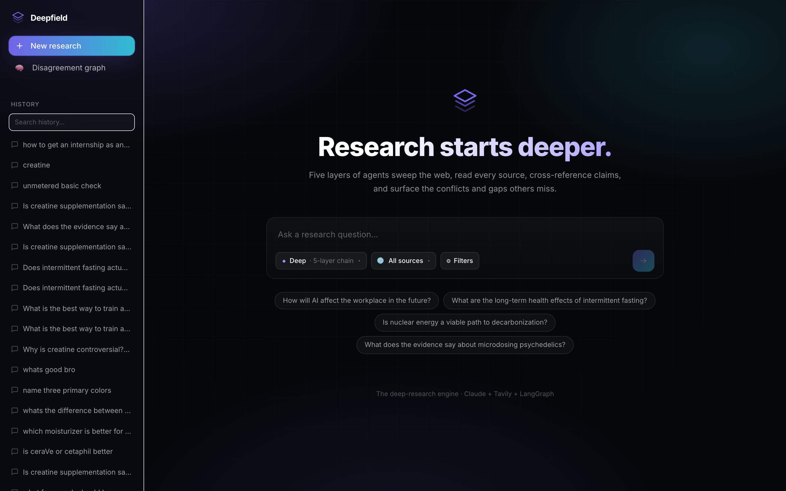
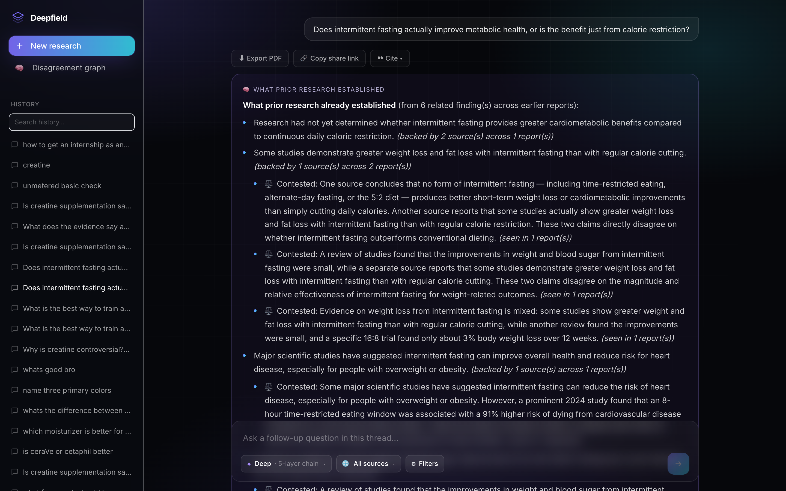
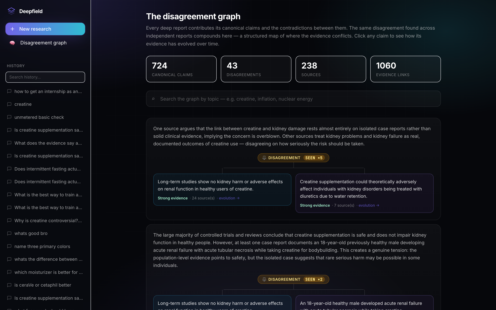

# Deepfield

**An AI deep-research engine that reads the web, cross-references what it finds, and surfaces where the sources *disagree* — then remembers it all in a knowledge graph that gets smarter with every question.**

Most AI search tools give you one confident answer and throw away their work. Deepfield treats research as a multi-stage agent pipeline and **persists the structured result**, so every report compounds into a growing map of what's contested in a field.

<p align="center">
  
</p>

<p align="center">
  <em>Built with</em><br>
  
  
  
  
  
  
</p>

---

## What makes it different

Run the same question into a normal LLM twice and you get two disconnected, throwaway answers. Deepfield instead:

- **Reads deeply, in parallel.** A fan-out layer reads each source in full and extracts atomic, checkable claims — not a one-shot summary.
- **Cross-references claims.** Semantically identical claims from different sources are clustered, so you see how much independent support an assertion actually has.
- **Surfaces disagreement instead of hiding it.** When sources contradict, Deepfield records the conflict and shows you both sides — the opposite of a single confident answer.
- **Compounds over time.** Every report writes into a persistent **disagreement graph** (Postgres + `pgvector`). New claims are deduplicated by embedding similarity and *merged* into existing nodes; contradictions become edges whose strength grows each time an independent report surfaces them. The more you use it, the more it knows before you even ask.

<p align="center">
  
</p>

<p align="center">
  
</p>

---

## Architecture

A research request kicks off a **LangGraph** state machine. Each node streams its progress to the browser over WebSockets, so you watch the agents work in real time.

```
                          ┌─────────────────────────────────────────────┐
   query ──▶  recall  ──▶ search ──▶ read (parallel) ──▶ cross-reference │
              (graph)                  per-source            (cluster)    │
                                       claims                             │
                          │                                              │
                          ▼                                              ▼
                    prior-knowledge                              conflict detection
                    injection                                    (contradictions)
                          │                                              │
                          ▼                                              ▼
                       synthesis  ◀────  graph writer (persist claims + edges)
                          │
                          ▼
                  streamed report  ──▶  React UI (live agent feed)
```

- **Backend** — FastAPI (fully async) + SQLAlchemy 2.0 over Postgres (`asyncpg`).
- **Agents** — a layered pipeline (`backend/agents/layer*.py`) orchestrated by LangGraph (`backend/pipeline/graph.py`). Web + academic source connectors (arXiv / Semantic Scholar / PubMed), credibility scoring, and claim extraction.
- **Knowledge graph** — `canonical_claims` (with 1024-dim embeddings + ANN index), `claim_evidence`, and `claim_links` (contradiction edges). Deduplication via Voyage embeddings + pgvector cosine similarity.
- **Realtime** — WebSocket broadcast of every agent log line to the client.
- **Auth & cost control** — JWT (bcrypt) auth; the app is account-gated, and deep runs are capped both **per-user-per-month** and by a **global daily ceiling** (the hard spend backstop). Caps are checked before any pipeline spawns, so a blocked run costs nothing.
- **Performance** — Anthropic prompt caching on the shared per-source system prompt (paid once, read from cache thereafter) and a token-bucket rate limiter sized to the API tier to avoid 429s.
- **Frontend** — React + Vite + Tailwind, hash-routed, with a live agent feed, report view, and a read-only graph explorer.

**Fail-soft by design:** if the embedding service or API key is absent, the graph layer silently no-ops and reports still work end to end.

---

## Tech stack

| Layer | Tools |
|---|---|
| Backend | Python, FastAPI, async SQLAlchemy 2.0, LangGraph, WebSockets |
| Database | PostgreSQL + pgvector |
| AI | Anthropic Claude (pipeline + synthesis), Voyage embeddings, prompt caching |
| Sources | Tavily web search, arXiv, Semantic Scholar, PubMed |
| Auth | JWT, bcrypt |
| Frontend | React, Vite, Tailwind CSS, react-markdown |
| Infra | Docker, Docker Compose |
| Tests | pytest (8 suites: pipeline, graph store, credibility, dedup, JSON extraction, API) |

---

## Quickstart

> Requires Docker + Docker Compose.

```bash
# 1. Clone
git clone https://github.com/shrish186/deepfield.git
cd deepfield

# 2. Configure secrets
cp .env.example .env
#   edit .env and add your keys:
#     ANTHROPIC_API_KEY   (required)
#     TAVILY_API_KEY      (required — web search)
#     VOYAGE_API_KEY      (optional — enables the disagreement graph; omit to run without it)
#     JWT_SECRET          (recommended — stable login sessions across restarts)

# 3. Run the whole stack
docker compose up -d --build

# 4. Open it
#   Frontend  →  http://localhost:5173
#   API docs  →  http://localhost:8000/docs
```

The database schema is created automatically on first boot (idempotent), including the `pgvector` extension and ANN index.

---

## Selected API

Interactive docs at `/docs`. A few of the endpoints:

| Method | Path | Purpose |
|---|---|---|
| `POST` | `/auth/signup`, `/auth/login` | Account creation / login (JWT) |
| `POST` | `/reports` | Start a research run (deep or basic) |
| `GET` | `/reports/{id}` | Full report (answer, sources, conflicts, gaps) |
| `GET` | `/reports/{id}/citations` | Export citations (APA / MLA / BibTeX) |
| `GET` | `/usage` | Remaining monthly deep-run allowance |
| `GET` | `/graph/disagreements` | Top contested claims across all reports |
| `GET` | `/graph/claims/{id}` | A claim, its evidence, and its evolution over time |
| `WS` | `/ws/reports/{id}` | Live agent progress stream |

---

## Project structure

```
backend/
  agents/        # layered research pipeline + embeddings, credibility, graph store
  pipeline/      # LangGraph wiring (deep), plus basic + chat modes
  api/           # FastAPI routes, auth, websocket
  db/            # SQLAlchemy models + async engine / schema init
  tests/         # pytest suites
frontend/
  src/components # React UI (agent feed, report view, graph explorer, auth)
  src/hooks      # auth + websocket hooks
docker-compose.yml
```

---

## Running tests

```bash
cd backend
pip install -r requirements.txt -r requirements-dev.txt
pytest
```

---

## Deploying

See **[DEPLOY.md](DEPLOY.md)** for a step-by-step Railway deployment (database +
backend + frontend). Before going live, set:

- `JWT_SECRET` (required in production), `DEEPFIELD_ENV=production`
- `ALLOWED_ORIGINS` to your frontend URL
- `DEEPFIELD_GLOBAL_DAILY_DEEP_RUNS` to your daily spend ceiling

…and set spend limits in the Anthropic and Tavily dashboards as an independent backstop.

---

## Status & roadmap

This is a working, end-to-end build. Known next steps:

- **Scale** — the pipeline currently runs in-process; a background worker queue is the path to concurrent load.
- **Evaluation** — the claim-merge similarity threshold is a tuned constant; precision/recall evaluation is planned.
- **Monetization** — usage caps are in place purely for cost control; a paid tier (e.g. Stripe-hosted checkout, no card data handled by this backend) is a deliberate later step.

---

## Self-hosting

Deepfield is meant to be run by anyone. The whole stack is in this repo — clone
it, add your own API keys (Anthropic + Tavily required; Voyage optional), and
either `docker compose up` locally or deploy with the included Render Blueprint
(see [DEPLOY.md](DEPLOY.md)). When you self-host, the API usage is billed to
*your* keys, not the maintainer's.

The hosted demo also supports **bring-your-own-key**: paste your own keys in the
app and your runs bill you directly (and skip the demo's shared usage caps).

## License

[MIT](LICENSE) © 2026 Shrish Kapoor. Use it, fork it, build on it.

## Note

Deepfield generates AI-assisted research and can be wrong. It's a tool for accelerating and structuring research — verify anything important against the cited primary sources.

---

<p align="center"><sub>Built by <a href="https://github.com/shrish186">Shrish Kapoor</a></sub></p>
